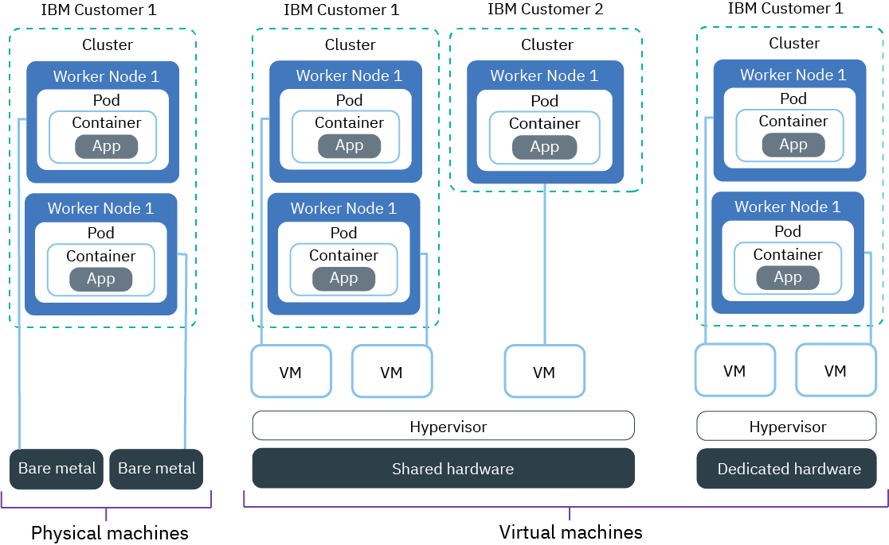

---

copyright:
  years: 2014, 2018
lastupdated: "2018-4-20"

---

{:new_window: target="_blank"}
{:shortdesc: .shortdesc}
{:screen: .screen}
{:pre: .pre}
{:table: .aria-labeledby="caption"}
{:codeblock: .codeblock}
{:tip: .tip}
{:download: .download}


# Setting up clusters
{: #clusters}

Design your Kubernetes cluster setup for maximum container availability and capacity with {{site.data.keyword.containerlong}}.
{:shortdesc}

## Cluster configuration planning
{: #planning_clusters}

Use standard clusters to increase app availability.
{:shortdesc}

Your users are less likely to experience downtime when you distribute your setup across multiple worker nodes and clusters. Built-in capabilities, like load balancing and isolation, increase resiliency against potential failures with hosts, networks, or apps.

Review these potential cluster setups that are ordered with increasing degrees of availability:


1.  One cluster with multiple worker nodes
2.  Two clusters that run in different locations in the same region, each with multiple worker nodes
3.  Two clusters that run in different regions, each with multiple worker nodes

Increase the availability of your cluster with these techniques:

<dl>
<dt>Spread apps across worker nodes</dt>
<dd>Allow developers to spread their apps in containers across multiple worker nodes per cluster. An app instance in each of three worker nodes allow for the downtime of one worker node without interrupting the usage of the app. You can specify how many worker nodes to include when you create a cluster from the [{{site.data.keyword.Bluemix_notm}} GUI](cs_clusters.html#clusters_ui) or the [CLI](cs_clusters.html#clusters_cli). Kubernetes limits the maximum number of worker nodes that you can have in a cluster, so keep in mind the [worker node and pod quotas ](https://kubernetes.io/docs/admin/cluster-large/).
<pre class="codeblock">
<code>{[bxcs]} cluster-create --location dal10 --workers 3 --public-vlan &lt;public_VLAN_ID&gt; --private-vlan &lt;private_VLAN_ID&gt; --machine-type &lt;u2c.2x4&gt; --name &lt;cluster_name_or_ID&gt;</code>
</pre>
</dd>
<dt>Spread apps across clusters</dt>
<dd>Create multiple clusters, each with multiple worker nodes. If an outage occurs with one cluster, users can still access an app that is also deployed in another cluster.
<p>Cluster 1:</p>
<pre class="codeblock">
<code>{[bxcs]} cluster-create --location dal10 --workers 3 --public-vlan &lt;public_VLAN_ID&gt; --private-vlan &lt;private_VLAN_ID&gt; --machine-type &lt;u2c.2x4&gt; --name &lt;cluster_name_or_ID&gt;</code>
</pre>
<p>Cluster 2:</p>
<pre class="codeblock">
<code>{[bxcs]} ccluster-create --location dal12 --workers 3 --public-vlan &lt;public_VLAN_ID&gt; --private-vlan &lt;private_VLAN_ID&gt; --machine-type &lt;u2c.2x4&gt; --name &lt;cluster_name_or_ID&gt;</code>
</pre>
</dd>
<dt>Spread apps across clusters in different regions</dt>
<dd>When you spread apps across clusters in different regions, you can allow load balancing to occur based on the region the user is in. If the cluster, hardware, or even an entire location in one region goes down, traffic is routed to the container that is deployed in another location.
<p><strong>Important:</strong> After you configure a custom domain, you can use these commands to create the clusters.</p>
<p>Location 1:</p>
<pre class="codeblock">
<code>{[bxcs]} cluster-create --location dal10 --workers 3 --public-vlan &lt;public_VLAN_ID&gt; --private-vlan &lt;private_VLAN_ID&gt; --machine-type &lt;u2c.2x4&gt; --name &lt;cluster_name_or_ID&gt;</code>
</pre>
<p>Location 2:</p>
<pre class="codeblock">
<code>{[bxcs]} cluster-create --location ams03 --workers 3 --public-vlan &lt;public_VLAN_ID&gt; --private-vlan &lt;private_VLAN_ID&gt; --machine-type &lt;u2c.2x4&gt; --name &lt;cluster_name_or_ID&gt;</code>
</pre>
</dd>
</dl>

{[white-space.md]}


## Worker node configuration planning
{: #planning_worker_nodes}

A Kubernetes cluster consists of worker nodes and is centrally monitored and managed by the Kubernetes master. Cluster admins decide how to set up the cluster of worker nodes to ensure that cluster users have all the resources to deploy and run apps in the cluster.
{:shortdesc}

When you create a standard cluster, worker nodes  are ordered in {[softlayer]} on your behalf and added to the default worker node pool in your cluster. Every worker node is assigned a unique worker node ID and domain name that must not be changed after the cluster is created.

You can choose between virtual or physical (bare metal) servers. Depending on the level of hardware isolation that you choose, virtual worker nodes can be set up as shared or dedicated nodes. You can also choose whether you want worker nodes to connect to a public VLAN and private VLAN, or only to a private VLAN. Every worker node is provisioned with a specific machine type that determines the number of vCPUs, memory, and disk space that are available to the containers that are deployed to the worker node. Kubernetes limits the maximum number of worker nodes that you can have in a cluster. Review [worker node and pod quotas ](https://kubernetes.io/docs/admin/cluster-large/) for more information.


### Hardware for worker nodes
{: #shared_dedicated_node}

When you create a standard cluster in {{site.data.keyword.Bluemix_notm}}, you choose to provision your worker nodes as physical machines (bare metal) or as virtual machines that run on physical hardware. When you create a free cluster, your worker node is automatically provisioned as a virtual, shared node in the {[softlayer]} account.
{:shortdesc}



{[hardware-options.md]}

Available physical and virtual machines types vary by the location in which you deploy the cluster. For more information, see the `{[bxcs]} machine-type` [command](cs_cli_reference.html#cs_machine_types). You can deploy clusters by using the [console UI](#clusters_ui) or the [CLI](#clusters_cli).

### VLAN connection for worker nodes
{: #worker_vlan_connection}

When you create a cluster, every cluster is automatically connected to a VLAN from your {[softlayer]} account.
{:shortdesc}

A VLAN configures a group of worker nodes and pods as if they were attached to the same physical wire. The private VLAN determines the private IP address that is assigned to a worker node during cluster creation, and the public VLAN determines the public IP address that is assigned to a worker node during cluster creation.

For free clusters, the cluster's worker nodes are connected to an IBM-owned public VLAN and private VLAN by default during cluster creation. For standard clusters, you must connect your worker nodes to a private VLAN. You can either connect your worker nodes to both a public VLAN and the private VLAN, or to the private VLAN only. If you want to connect your worker nodes to a private VLAN only, you can designate the ID of an existing private VLAN during cluster creation or [create a private VLAN](/docs/cli/reference/softlayer/index.html#sl_vlan_create). {[private_vlan_vyatta]}

**Note**: If you have multiple VLANs for a cluster or multiple subnets on the same VLAN, you must turn on VLAN spanning so that your worker nodes can communicate with each other on the private network. For instructions, see [Enable or disable VLAN spanning](/docs/infrastructure/vlans/vlan-spanning.html#enable-or-disable-vlan-spanning).

### Worker node memory limits
{: #resource_limit_node}

{{site.data.keyword.containershort_notm}} sets a memory limit on each worker node. When pods that are running on the worker node exceed this memory limit, the pods are removed. In Kubernetes, this limit is called a [hard eviction threshold ](https://kubernetes.io/docs/tasks/administer-cluster/out-of-resource/#hard-eviction-thresholds).
{:shortdesc}

If your pods are removed frequently, add more worker nodes to your cluster or set [resource limits ](https://kubernetes.io/docs/concepts/configuration/manage-compute-resources-container/#resource-requests-and-limits-of-pod-and-container) on your pods.

Each machine type has a different memory capacity. When there is less memory available on the worker node than the mininum threshold that is allowed, Kubernetes immediately removes the pod. The pod reschedules onto another worker node if a worker node is available.

|Worker node memory capacity|Minumum memory threshold of a worker node|
|---------------------------|------------|
|4 GB  | 256 MB |
|16 GB | 1024 MB |
|64 GB | 4096 MB |
|128 GB| 4096 MB |
|242 GB| 4096 MB |

To review how much memory is used on your worker node, run [kubectl top node ](https://kubernetes.io/docs/reference/generated/kubectl/kubectl-commands#top).

### Autorecovery for your worker nodes
`Docker`, `kubelet`, `kube-proxy`, and `calico` are critical components that must be functional to have a healthy Kubernetes worker node. Over time these components can break and may leave your worker node in a nonfunctional state. Nonfunctional worker nodes decrease total capacity of the cluster and can result in downtime for your app.

You can [configure health checks for your worker node and enable Autorecovery](cs_health.html#autorecovery). If Autorecovery detects an unhealthy worker node based on the configured checks, Autorecovery triggers a corrective action like an OS reload on the worker node. For more information about how Autorecovery works, see the [Autorecovery blog ](https://www.ibm.com/blogs/bluemix/2017/12/autorecovery-utilizes-consistent-hashing-high-availability/).

{[white-space.md]}


## Creating clusters with the GUI
{: #clusters_ui}

The purpose of the Kubernetes cluster is to define a set of resources, nodes, networks, and storage devices that keep apps highly available. Before you can deploy an app, you must create a cluster and set the definitions for the worker nodes in that cluster.
{:shortdesc}

Before you begin, you must have a Pay-As-You-Go or Subscription [{{site.data.keyword.Bluemix_notm}} account](https://console.bluemix.net/registration/). To try out some of the capabilities you can create a free cluster that expires after 21 days. You are able to have 1 free cluster at a time.

You can remove your free cluster at any time, but after 21 days a free cluster and its data are deleted and cannot be restored. Be sure to back up your data.
{: tip}

To fully-customize your clusters with your choice of hardware isolation, location, API version and more, create a standard cluster.

To create a cluster:

1. In the catalog, select **Kubernetes Cluster**.

2. Select a region in which to deploy your cluster.

3. Select a type of cluster plan. You can choose either **Free** or **Standard**. With a standard cluster you have access to features like multiple worker nodes for a highly available environment.

4. Configure your cluster details. Complete the steps that apply to the type of cluster that you are creating.

    1. **Free and Standard**: Give your cluster a name. {[cluster-name.md]}
    2. **Standard**: Select a location in which to deploy your cluster. For the best performance, select the location that is physically closest to you. Keep in mind that you might require legal authorization before data can be physically stored in a foreign country if you select a location that is outside your country.

    3. **Standard**: Choose the Kubernetes API server version for the cluster master node.

    4. **Standard**: Select a type of hardware isolation. Virtual is billed hourly and bare metal is billed monthly.

        - **Virtual - Dedicated**: Your worker nodes are hosted on infrastructure that is devoted to your account. Your physical resources are completely isolated.

        - **Virtual - Shared**: Infrastructure resources, such as the hypervisor and physical hardware, are shared across you and other IBM customers, but each worker node is accessible only by you. Although this option is less expensive and sufficient in most cases, you might want to verify your performance and infrastructure requirements with your company policies.

        - **Bare Metal**: Billed monthly, bare metal servers are provisioned by manual interaction with {[softlayer]}, and can take more than one business day to complete. Bare metal is best suited for high-performance applications that need more resources and host control. 

        Be sure that you want to provision a bare metal machine. Because it is billed monthly, if you cancel it immediately after an order by mistake, you are still charged the full month.
        {:tip}

    5.  **Standard**: Select a machine type. The machine type defines the amount of virtual CPU, memory, and disk space that is set up in each worker node and made available to the containers. Available bare metal and virtual machines types vary by the location in which you deploy the cluster. After you create your cluster, you can add different machine types by adding a node to the cluster.

    6. **Standard**: Specify the number of worker nodes that you need in the cluster.

    7. **Standard**: Select a public VLAN (optional) and private VLAN (required) from your {[softlayer]} account. Both VLANs communicate between worker nodes but the public VLAN also communicates with the IBM-managed Kubernetes master. You can use the same VLAN for multiple clusters.
        **Note**: {[private_vlan_vyatta]}

    8. By default, **Encrypt local disk** is selected. If you choose to clear the check box, then the host's Docker data is not encrypted.[Learn more about the encryption](cs_secure.html#encrypted_disks).

4. Click **Create cluster**. You can see the progress of the worker node deployment in the **Worker nodes** tab. When the deploy is done, you can see that your cluster is ready in the **Overview** tab.
    **Note:** Every worker node is assigned a unique worker node ID and domain name that must not be manually changed after the cluster is created. Changing the ID or domain name prevents the Kubernetes master from managing your cluster.

**What's next?**

When the cluster is up and running, you can check out the following tasks:


-   [Install the CLIs to start working with your cluster.](cs_cli_install.html#cs_cli_install)
-   [Deploy an app in your cluster.](cs_app.html#app_cli)
-   [Set up your own private registry in {{site.data.keyword.Bluemix_notm}} to store and share Docker images with other users.](/docs/services/Registry/index.html)
- If you have multiple VLANs for a cluster or multiple subnets on the same VLAN, you must [turn on VLAN spanning](/docs/infrastructure/vlans/vlan-spanning.html#enable-or-disable-vlan-spanning) so that your worker nodes can communicate with each other on the private network.
- If you have a firewall, you might need to [open the required ports](cs_firewall.html#firewall) to use `{[bx]}`, `kubectl`, or `calicotl` commands, to allow outbound traffic from your cluster, or to allow inbound traffic for networking services.

{[white-space.md]}

## Creating clusters with the CLI
{: #clusters_cli}

The purpose of the Kubernetes cluster is to define a set of resources, nodes, networks, and storage devices that keep apps highly available. Before you can deploy an app, you must create a cluster and set the definitions for the worker nodes in that cluster.
{:shortdesc}

Before you begin:
- You must have a Pay-As-You-Go or Subscription [{{site.data.keyword.Bluemix_notm}} account](https://console.bluemix.net/registration/). You can create 1 free cluster to try out some of the capabilities for 21 days, or create fully-customizable standard clusters with your choice of hardware isolation.
- [Make sure you have the minimum required permissions in {[softlayer]} to provision a standard cluster](cs_users.html#infra_access).

To create a cluster:

1.  Install the {{site.data.keyword.Bluemix_notm}} CLI and the [{[pluginname]}](cs_cli_install.html#cs_cli_install).

2.  Log in to the {{site.data.keyword.Bluemix_notm}} CLI. Enter your {{site.data.keyword.Bluemix_notm}} credentials when prompted.

    ```
    {[bx]} login
    ```
    {: pre}

    **Note:** If you have a federated ID, use `{[bx]} login --sso` to log in to the {{site.data.keyword.Bluemix_notm}} CLI. Enter your user name and use the provided URL in your CLI output to retrieve your one-time passcode. You know you have a federated ID when the login fails without the `--sso` and succeeds with the `--sso` option.

3. If you have multiple {{site.data.keyword.Bluemix_notm}} accounts, select the account where you want to create your Kubernetes cluster.

4.  If you want to create or access Kubernetes clusters in a region other than the {{site.data.keyword.Bluemix_notm}} region that you selected earlier, run `{[bxcs]} region-set`.

6.  Create a cluster.

    1.  **Standard clusters**: Review the locations that are available. The locations that are shown depend on the {{site.data.keyword.containershort_notm}} region that you are logged in.

        ```
        {[bxcs]} locations
        ```
        {: pre}

        Your CLI output matches the [locations for the container region](cs_regions.html#locations).

    2.  **Standard clusters**: Choose a location and review the machine types available in that location. The machine type specifies the virtual or physical compute hosts that are available to each worker node.

        -  View the **Server Type** field to choose virtual or physical (bare metal) machines.
        -  **Virtual**: Billed hourly, virtual machines are provisioned on shared or dedicated hardware.
        -  **Physical**: Billed monthly, bare metal servers are provisioned by manual interaction with {[softlayer]}, and can take more than one business day to complete. Bare metal is best suited for high-performance applications that need more resources and host control.
        - **Physical machines with Trusted Compute**: For bare metal clusters that run Kubernetes version 1.9 or later, you can also choose to enable [Trusted Compute](cs_secure.html#trusted_compute) to verify your bare metal worker nodes against tampering. If you don't enable trust during cluster creation but want to later, you can use the `{[bxcs]} feature-enable` [command](cs_cli_reference.html#cs_cluster_feature_enable). After you enable trust, you cannot disable it later.
        -  **Machine types**: To decide what machine type to deploy, review the core, memory, and storage combinations or consult the `{[bxcs]} machine-types` [command documentation](cs_cli_reference.html#cs_machine_types). After you create your cluster, you can add different physical or virtual machine types by using the `{[bxcs]} worker-add` [command](cs_cli_reference.html#cs_worker_add).

           Be sure that you want to provision a bare metal machine. Because it is billed monthly, if you cancel it immediately after an order by  mistake, you are still charged the full month.
           {:tip}

        ```
        {[bxcs]} machine-types <location>
        ```
        {: pre}

    3.  **Standard clusters**: Check to see if a public and private VLAN already exists in the {[softlayer]} for this account.

        ```
        {[bxcs]} vlans <location>
        ```
        {: pre}

        ```
        ID        Name   Number   Type      Router
        1519999   vlan   1355     private   bcr02a.dal10
        1519898   vlan   1357     private   bcr02a.dal10
        1518787   vlan   1252     public    fcr02a.dal10
        1518888   vlan   1254     public    fcr02a.dal10
        ```
        {: screen}

        If a public and private VLAN already exist, note the matching routers. {[matching_vlans]} In the example output, any of the private VLANs can be used with any of public VLANs because the routers all include `02a.dal10`.

        You must connect your worker nodes to a private VLAN, and optionally, you can connect your worker nodes to a public VLAN. **Note**: {[private_vlan_vyatta]}

    4.  **Free and standard clusters**: Run the `cluster-create` command. You can choose between a free cluster, which includes one worker node set up with 2vCPU and 4GB memory and is automatically deleted after 21 days. When you create a standard cluster, by default, the worker node disks are encrypted, its hardware is shared by multiple IBM customers, and it is billed by hours of usage. </br>Example for a standard cluster. Specify the cluster's options:

        ```
        {[bxcs]} cluster-create --location dal10 --machine-type u2c.2x4 --hardware <shared_or_dedicated> --public-vlan <public_VLAN_ID> --private-vlan <private_VLAN_ID> --workers 3 --name <cluster_name> --kube-version <major.minor.patch> [--disable-disk-encrypt] [--trusted]
        ```
        {: pre}

        Example for a free cluster. Specify the cluster name:

        ```
        {[bxcs]} cluster-create --name my_cluster
        ```
        {: pre}

        <table>
        <thead>
        <th colspan=2> Understanding this command's components</th>
        </thead>
        <tbody>
        <tr>
        <td><code>cluster-create</code></td>
        <td>The command to create a cluster in your {{site.data.keyword.Bluemix_notm}} organization.</td>
        </tr>
        <tr>
        <td><code>--location <em>&lt;location&gt;</em></code></td>
        <td>**Standard clusters**: Replace <em>&lt;location&gt;</em> with the {{site.data.keyword.Bluemix_notm}} location ID where you want to create your cluster. [Available locations](cs_regions.html#locations) depend on the {{site.data.keyword.containershort_notm}} region you are logged in to.</td>
        </tr>
        <tr>
        <td><code>--machine-type <em>&lt;machine_type&gt;</em></code></td>
        <td>**Standard clusters**: Choose a machine type. You can deploy your worker nodes as virtual machines on shared or dedicated hardware, or as physical machines on bare metal. Available physical and virtual machines types vary by the location in which you deploy the cluster. For more information, see the documentation for the `{[bxcs]} machine-type` [command](cs_cli_reference.html#cs_machine_types). For free clusters, you do not have to define the machine type.</td>
        </tr>
        <tr>
        <td><code>--hardware <em>&lt;shared_or_dedicated&gt;</em></code></td>
        <td>**Standard clusters, virtual-only**: The level of hardware isolation for your worker node. Use dedicated to have available physical resources dedicated to you only, or shared to allow physical resources to be shared with other IBM customers. The default is shared. This value is optional for standard clusters and is not available for free clusters.</td>
        </tr>
        <tr>
        <td><code>--public-vlan <em>&lt;public_vlan_id&gt;</em></code></td>
        <td><ul>
          <li>**Free clusters**: You do not have to define a public VLAN. Your free cluster is automatically connected to a public VLAN that is owned by IBM.</li>
          <li>**Standard clusters**: If you already have a public VLAN set up in your {[softlayer]} account for that location, enter the ID of the public VLAN. If you want to connect your worker nodes to a private VLAN only, do not specify this option. **Note**: {[private_vlan_vyatta]}<br/><br/>
          <strong>Note</strong>: {[matching_vlans]}</li>
        </ul></td>
        </tr>
        <tr>
        <td><code>--private-vlan <em>&lt;private_vlan_id&gt;</em></code></td>
        <td><ul><li>**Free clusters**: You do not have to define a private VLAN. Your free cluster is automatically connected to a private VLAN that is owned by IBM.</li><li>**Standard clusters**: If you already have a private VLAN set up in your {[softlayer]} account for that location, enter the ID of the private VLAN. If you do not have a private VLAN in your account, do not specify this option. {{site.data.keyword.containershort_notm}} automatically creates a private VLAN for you.<br/><br/><strong>Note</strong>: {[matching_vlans]}</li></ul></td>
        </tr>
        <tr>
        <td><code>--name <em>&lt;name&gt;</em></code></td>
        <td>**Free and standard clusters**: Replace <em>&lt;name&gt;</em> with a name for your cluster. {[cluster-name.md]}</td>
        </tr>
        <tr>
        <td><code>--workers <em>&lt;number&gt;</em></code></td>
        <td>**Standard clusters**: The number of worker nodes to include in the cluster. If the <code>--workers</code> option is not specified, 1 worker node is created.</td>
        </tr>
        <tr>
          <td><code>--kube-version <em>&lt;major.minor.patch&gt;</em></code></td>
          <td>**Standard clusters**: {[kube-version-flag.md]}</td>
        </tr>
        <tr>
        <td><code>--disable-disk-encrypt</code></td>
        <td>**Free and standard clusters**: Worker nodes feature disk encryption by default; [learn more](cs_secure.html#encrypted_disks). If you want to disable encryption, include this option.</td>
        </tr>
        <tr>
        <td><code>--trusted</code></td>
        <td>**Standard bare metal clusters**: Enable [Trusted Compute](cs_secure.html#trusted_compute) to verify your bare metal worker nodes against tampering. If you don't enable trust during cluster creation but want to later, you can use the `{[bxcs]} feature-enable` [command](cs_cli_reference.html#cs_cluster_feature_enable). After you enable trust, you cannot disable it later.</td>
        </tr>
        </tbody></table>

7.  Verify that the creation of the cluster was requested.

    ```
    {[bxcs]} clusters
    ```
    {: pre}

    **Note:** For virtual machines, it can take a few minutes for the worker node machines to be ordered, and for the cluster to be set up and provisioned in your account. Bare metal physical machines are provisioned by manual interaction with {[softlayer]}, and can take more than one business day to complete.

    When the provisioning of your cluster is completed, the status of your cluster changes to **deployed**.

    ```
    Name         ID                                   State      Created          Workers   Location   Version
    my_cluster   paf97e8843e29941b49c598f516de72101   deployed   20170201162433   1         mil01      {[kubeversions]}
    ```
    {: screen}

8.  Check the status of the worker nodes.

    ```
    {[bxcs]} workers <cluster_name_or_ID>
    ```
    {: pre}

    When the worker nodes are ready, the state changes to **normal** and the status is **Ready**. When the node status is **Ready**, you can then access the cluster.

    **Note:** Every worker node is assigned a unique worker node ID and domain name that must not be changed manually after the cluster is created. Changing the ID or domain name prevents the Kubernetes master from managing your cluster.

    ```
    ID                                                 Public IP       Private IP      Machine Type   State    Status   Location   Version
    kube-mil01-paf97e8843e29941b49c598f516de72101-w1   {[public_IP]}  {[internal_cluster_IP]}   free           normal   Ready    mil01      {[kubeversions]}
    ```
    {: screen}

9. Set the cluster you created as the context for this session. Complete these configuration steps every time that you work with your cluster.
    1.  Get the command to set the environment variable and download the Kubernetes configuration files.

        ```
        {[bxcs]} cluster-config <cluster_name_or_ID>
        ```
        {: pre}

        When the download of the configuration files is finished, a command is displayed that you can use to set the path to the local Kubernetes configuration file as an environment variable.

        Example for OS X:

        ```
        export KUBECONFIG=/Users/<user_name>/.bluemix/plugins/{[pluginname_short]}/clusters/mycluster/kube-config-prod-dal10-mycluster.yml
        ```
        {: screen}

    2.  Copy and paste the command that is displayed in your terminal to set the `KUBECONFIG` environment variable.
    3.  Verify that the `KUBECONFIG` environment variable is set properly.

        Example for OS X:

        ```
        echo $KUBECONFIG
        ```
        {: pre}

        Output:

        ```
        /Users/<user_name>/.bluemix/plugins/{[pluginname_short]}/clusters/mycluster/kube-config-prod-dal10-mycluster.yml

        ```
        {: screen}

10. Launch your Kubernetes dashboard with the default port `8001`.
    1.  Set the proxy with the default port number.

        ```
        kubectl proxy
        ```
        {: pre}

        ```
        Starting to serve on 127.0.0.1:8001
        ```
        {: screen}

    2.  Open the following URL in a web browser to see the Kubernetes dashboard.

        ```
        http://localhost:8001/ui
        ```
        {: codeblock}


**What's next?**


-   [Deploy an app in your cluster.](cs_app.html#app_cli)
-   [Manage your cluster with the `kubectl` command line. ](https://kubernetes.io/docs/user-guide/kubectl/)
-   [Set up your own private registry in {{site.data.keyword.Bluemix_notm}} to store and share Docker images with other users.](/docs/services/Registry/index.html)
- If you have multiple VLANs for a cluster or multiple subnets on the same VLAN, you must [turn on VLAN spanning](/docs/infrastructure/vlans/vlan-spanning.html#enable-or-disable-vlan-spanning) so that your worker nodes can communicate with each other on the private network.
- If you have a firewall, you might need to [open the required ports](cs_firewall.html#firewall) to use `{[bx]}`, `kubectl`, or `calicotl` commands, to allow outbound traffic from your cluster, or to allow inbound traffic for networking services.

{[white-space.md]}


## Viewing cluster states
{: #states}

Review the state of a Kubernetes cluster to get information about the availability and capacity of the cluster, and potential problems that might have occurred.
{:shortdesc}

To view information about a specific cluster, such as its location, master URL, Ingress subdomain, version, workers, owner, and monitoring dashboard, use the `{[bxcs]} cluster-get <cluster_name_or_ID>` [command](cs_cli_reference.html#cs_cluster_get). Include the `--showResources` flag to view more cluster resources such as add-ons for storage pods or subnet VLANs for public and private IPs.

You can view the current cluster state by running the `{[bxcs]} clusters` command and locating the **State** field. To troubleshoot your cluster and worker nodes, see [Troubleshooting clusters](cs_troubleshoot.html#debug_clusters).

{[cluster-states.md]}

{[white-space.md]}

## Removing clusters
{: #remove}

Free and standard clusters that are created with a Pay-As-You-Go account must be removed manually when they are not needed anymore so that those clusters are no longer consuming resources.
{:shortdesc}

**Warning:**
  - No backups are created of your cluster or your data in your persistent storage. Deleting a cluster or persistent storage is permanent and cannot be undone.
  - When you remove a cluster, you also remove any subnets that were automatically provisioned when you created the cluster and that you created by using the `{[bxcs]} cluster-subnet-create` command. However, if you manually added existing subnets to your cluster by using the `{[bxcs]} cluster-subnet-add command`, these subnets are not removed from your {[softlayer]} account and you can reuse them in other clusters.

To remove a cluster:

-   From the {{site.data.keyword.Bluemix_notm}} GUI
    1.  Select your cluster and click **Delete** from the **More actions...** menu.

-   From the {{site.data.keyword.Bluemix_notm}} CLI
    1.  List the available clusters.

        ```
        {[bxcs]} clusters
        ```
        {: pre}

    2.  Delete the cluster.

        ```
        {[bxcs]} cluster-rm <cluster_name_or_ID>
        ```
        {: pre}

    3.  Follow the prompts and choose whether to delete cluster resources, which includes containers, pods, bound services, persistent storage, and secrets.
      - **Persistent storage**: Persistent storage provides high availability for your data. If you created a persistent volume claim by using an [existing file share](cs_storage.html#existing), then you cannot delete the file share when you delete the cluster. You must manually delete the file share later from your {[softlayer]} portfolio.

          **Note**: Due to the monthly billing cycle, a persistent volume claim cannot be deleted on the last day of a month. If you delete the persistent volume claim on the last day of the month, the deletion remains pending until the beginning of the next month.

Next steps:
- After it is no longer listed in the available clusters list when you run the `{[bxcs]} clusters` command, you can reuse the name of a removed cluster.
- If you kept the subnets, you can [reuse them in a new cluster](cs_subnets.html#custom) or manually delete them later from your {[softlayer]} portfolio.
- If you kept the persistent storage, you can delete your storage later through the IBM Cloud infrastructure (SoftLayer) dashboard in the {{site.data.keyword.Bluemix_notm}} GUI.
