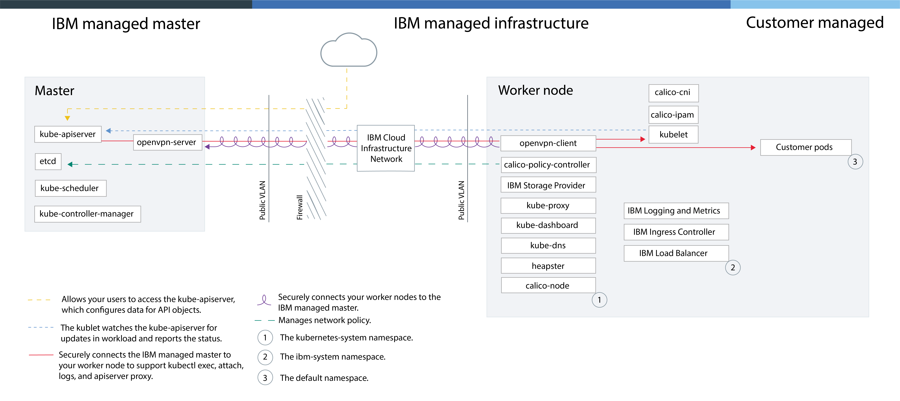

---

copyright:
  years: 2014, 2017
lastupdated: "2017-10-31"

---

{:new_window: target="_blank"}
{:shortdesc: .shortdesc}
{:screen: .screen}
{:pre: .pre}
{:table: .aria-labeledby="caption"}
{:codeblock: .codeblock}
{:tip: .tip}
{:download: .download}

# Managing clusters in {{site.data.keyword.Bluemix_dedicated_notm}} (Closed Beta)
{: #dedicated}

Deploy clusters (Closed Beta) or single and scalable containers in a dedicated cloud environment (`https://<my-dedicated-cloud-instance>.bluemix.net`) and connect with the preselected {{site.data.keyword.Bluemix}} services that are also running there.
{:shortdesc}

## About the {{site.data.keyword.Bluemix_dedicated_notm}} cloud environment
{: #dedicated_environment}

Clusters with {{site.data.keyword.Bluemix_dedicated}} are equivalent to clusters that are created with dedicated hardware in {{site.data.keyword.Bluemix_notm}} Public. Available physical resources are dedicated to your cluster only and are not shared with clusters from other {{site.data.keyword.IBM_notm}} customers. For both Public and for Dedicated, the public API endpoint is used to create clusters. However, with {{site.data.keyword.Bluemix_notm}} Dedicated, the most significant differences are as followed.

*   {{site.data.keyword.IBM_notm}} owns and manages the IBM Bluemix Infrastructure (SoftLayer) account that the worker nodes, VLANs, and subnets are deployed into, rather than in an account that is owned by you.
*   Specifications for those VLANs and subnets are determined when the Dedicated environment is created, not when the cluster is created.

You might choose to set up a {{site.data.keyword.Bluemix_dedicated_notm}} environment when you want isolation for your cluster and you also require such isolation for the other {{site.data.keyword.Bluemix_notm}} services that you use.

### Differences in cluster management between the cloud environments
{: #dedicated_env_differences}

|Area|{{site.data.keyword.Bluemix_notm}} Public|{{site.data.keyword.Bluemix_dedicated_notm}} (Closed Beta)|
|--|--------------|--------------------------------|
|Cluster creation|Create a lite cluster or specify the following details for a standard cluster:<ul><li>Cluster type</li><li>Name</li><li>Location</li><li>Machine type</li><li>Number of worker nodes</li><li>Public VLAN</li><li>Private VLAN</li><li>Hardware</li></ul>|Specify the following details for a standard cluster:<ul><li>Name</li><li>Kubernetes version</li><li>Machine type</li><li>Number of worker nodes</li></ul><p>**Note:** The VLANs and Hardware settings are pre-defined during the creation of the {{site.data.keyword.Bluemix_notm}} environment.</p>|
|Cluster hardware and ownership|In standard clusters, the hardware can be shared by other {{site.data.keyword.IBM_notm}} customers or dedicated to you only. The public and private VLANs are owned and managed by you in your IBM Bluemix Infrastructure (SoftLayer) account.|In clusters on {{site.data.keyword.Bluemix_dedicated_notm}}, the hardware is always dedicated. The public and private VLANs are owned and managed by IBM for you. Location is pre-defined for the {{site.data.keyword.Bluemix_notm}} environment.|
|Service binding with a cluster|Use the [bx cs cluster-service-bind](cs_cluster.html#cs_cluster_service) command to bind a Kubernetes secret to the cluster.|Create a [JSON key file](cs_dedicated.html#dedicated_binding_services) for the service credentials, and then create a Kubernetes secret from that file to bind to the cluster.|
|Load balancer and Ingress networking|During the provisioning of standard clusters, the following actions occur automatically.<ul><li>A public portable subnet is bound to your cluster and assigned to your IBM Bluemix Infrastructure (SoftLayer) account.</li><li>One portable public IP address is used for a highly available Ingress controller and a unique public route is assigned in the format &lt;cluster_name&gt;.containers.mybluemix.net. You can use this route to expose multiple apps to the public.</li><li>Four portable public IP addresses are assigned to the cluster that can be used to expose apps to the public via load balancer services. Additional subnets can be requested through your IBM Bluemix Infrastructure (SoftLayer) account.</li></ul>|When you create your Dedicated account, you make the following decisions:<ul><li>How many subnets you want</li><li>The type of subnets you want, either load balancer or Ingress. {{site.data.keyword.IBM_notm}} creates the subnets and performs the network management tasks for you. Depending on your selections, an Ingress controller might be created and a public route might be assigned. Additional subnets can be requested by [opening a support ticket](/docs/support/index.html#contacting-support) to create the subnet, and then use the [`bx cs cluster-subnet-add`](cs_cli_reference.html#cs_cluster_subnet_add) command to add the subnet to the cluster.|
|NodePort networking|Expose a public port on your worker node and use the public IP address of the worker node to publicly access your service in the cluster.|All public IP addresses of the workers nodes are blocked by a firewall. However, for {{site.data.keyword.Bluemix_notm}} services that are added to the cluster, the node port can be accessed via a public IP address or a private IP address.|
|Persistent storage|Use [dynamic provisioning](cs_apps.html#cs_apps_volume_claim) or [static provisioning](cs_cluster.html#cs_cluster_volume_create) of volumes.|Use [dynamic provisioning](cs_apps.html#cs_apps_volume_claim) of volumes. [Open a support ticket](/docs/support/index.html#contacting-support) to request a backup for your volumes, request a restoration from your volumes, and perform other storage functions.</li></ul>|
|Image registry URL in {{site.data.keyword.registryshort_notm}}|<ul><li>US-South and US-East: <code>registry.ng bluemix.net</code></li><li>UK-South: <code>registry.eu-gb.bluemix.net</code></li><li>EU-Central (Frankfurt): <code>registry.eu-de.bluemix.net</code></li><li>Australia (Sydney): <code>registry.au-syd.bluemix.net</code></li></ul>|<ul><li>For new namespaces, use the same region-based registries that are defined for {{site.data.keyword.Bluemix_notm}} Public.</li><li>For namespaces that were set up for single and scalable containers in {{site.data.keyword.Bluemix_dedicated_notm}}, use <code>registry.&lt;dedicated_domain&gt;</code></li></ul>|
|Accessing the registry|See the options in [Using private and public image registries with {{site.data.keyword.containershort_notm}}](cs_cluster.html#cs_apps_images).|<ul><li>For new namespaces, see the options in [Using private and public image registries with {{site.data.keyword.containershort_notm}}](cs_cluster.html#cs_apps_images).</li><li>For namespaces that were set up for single and scalable groups, [use a token and create a Kubernetes secret](cs_dedicated_tokens.html#cs_dedicated_tokens) for authentication.</li></ul>|
{: caption="Table 1. Feature differences between {{site.data.keyword.Bluemix_notm}} Public and {{site.data.keyword.Bluemix_dedicated_notm}}" caption-side="top"}

<br />


### Service architecture
{: #dedicated_ov_architecture}

Each worker node is set up with an {{site.data.keyword.IBM_notm}}-managed Docker Engine, separate compute resources, networking, and volume service. Built-in security features provide isolation, resource management capabilities, and worker node security compliance. The worker node communicates with the master by using secure TLS certificates and openVPN connection.
{:shortdesc}

*Figure 1. Kubernetes architecture and networking in the {{site.data.keyword.Bluemix_dedicated_notm}}*

<a href="../api/content/containers/images/cs_dedicated_arch.png"></a>

<br />


## Setting up {{site.data.keyword.containershort_notm}} on {{site.data.keyword.Bluemix_dedicated_notm}}
{: #dedicated_setup}

Administrators must add the IBM administrator ID and users of your organization to the Dedicated environment.

Before you begin, [set up a {{site.data.keyword.Bluemix_dedicated_notm}} environment](/docs/dedicated/index.html#setupdedicated).

To set up your Dedicated environment to use clusters:

1.  Add the provided IBM administrator ID to the environment.
    1.  Select your {{site.data.keyword.Bluemix_dedicated_notm}} account.
    2.  From the menu bar, click **Manage > Security > Identity and Access**. The Users window displays a list of users with their email addresses and status for the selected account.
    3.  Click **Invite users**.
    4.  In **Email address or existing IBMid**, enter the following email address: `cfsdl@us.ibm.com`.
    5.  In the **Access** section, expand **Identity and Access enabled services**.
    6.  From the **Services** list, select **{{site.data.keyword.containershort_notm}}**.
    7.  From the **Roles** list, select **Administrator**.
    8.  Click **Invite users**.
2.  [Create IBMids for the end users of your {{site.data.keyword.Bluemix_notm}} account. ](https://www.ibm.com/account/us-en/signup/register.html)
3.  [Add the users from the previous step to your {{site.data.keyword.Bluemix_notm}} account.](cs_cluster.html#add_users)
4.  Access your {{site.data.keyword.Bluemix_dedicated_notm}} account through the Public console and start creating clusters.
    1.  Log in to {{site.data.keyword.Bluemix_notm}} Public console ([https://console.bluemix.net ](https://console.bluemix.net)) with your IBMid.
    2.  From the account menu, select your {{site.data.keyword.Bluemix_dedicated_notm}} account. The console is updated with the services and information for your {{site.data.keyword.Bluemix_dedicated_notm}} instance.
    3.  From the catalog for your {{site.data.keyword.Bluemix_dedicated_notm}} instance, select **Containers** and click **Kubernetes cluster**.
    For more information about creating a cluster, see [Creating Kubernetes clusters from the GUI in {{site.data.keyword.Bluemix_dedicated_notm}} (Closed Beta)](cs_cluster.html#creating_ui_dedicated).
5. If your local system or your corporate network controls public internet endpoints by using proxies or firewalls, see [Opening required ports and IP addresses in your firewall](cs_security.html#opening_ports).

<br />


## Setting up clusters in {{site.data.keyword.Bluemix_dedicated_notm}}
{: #dedicated_administering}

Design your cluster setup for maximum availability and capacity.
{:shortdesc}

### Creating clusters with the GUI
{: #dedicated_creating_ui}

1.  Log in to {{site.data.keyword.Bluemix_notm}} Public console ([https://console.bluemix.net ](https://console.bluemix.net)) with your IBMid.
2.  From the account menu, select your {{site.data.keyword.Bluemix_dedicated_notm}} account. The console is updated with the services and information for your {{site.data.keyword.Bluemix_dedicated_notm}} instance.
3.  From the catalog, select **Containers** and click **Kubernetes cluster**.
4.  Enter a **Cluster Name**.
5.  Select a **Machine type**. The machine type defines the amount of virtual CPU and memory that is set up in each worker node. This virtual CPU and memory is available for all the containers that you deploy in your nodes.
    -   The micro machine type indicates the smallest option.
    -   A balanced machine type has an equal amount of memory that is assigned to each CPU, which optimizes performance.
6.  Choose the **Number of worker nodes** that you need. Select `3` to ensure high availability of your cluster.
7.  Click **Create Cluster**. The details for the cluster open, but the worker nodes in the cluster take a few minutes to provision. On the **Worker nodes** tab, you can see the progress of the worker node deployment. When the worker nodes are ready, the state changes to **Ready**.

### Creating clusters with the CLI
{: #dedicated_creating_cli}

1.  Install the {{site.data.keyword.Bluemix_notm}} CLI and the [{{site.data.keyword.containershort_notm}} plug-in](cs_cli_install.html#cs_cli_install).
2.  Log in to the public endpoint for {{site.data.keyword.containershort_notm}}. Enter your {{site.data.keyword.Bluemix_notm}} credentials and select the {{site.data.keyword.Bluemix_dedicated_notm}} account when prompted.

    ```
    bx login -a api.<region>.bluemix.net
    ```
    {: pre}

    **Note:** If you have a federated ID, use `bx login --sso` to log in to the {{site.data.keyword.Bluemix_notm}} CLI. Enter your user name and use the provided URL in your CLI output to retrieve your one-time passcode. You know that you have a federated ID when the login fails without the `--sso` and succeeds with the `--sso` option.

3.  Create a cluster with the `cluster-create` command. When you create a standard cluster, the hardware of the worker node is billed by hours of usage.

    Example:

    ```
    bx cs cluster-create --location <location> --machine-type <machine-type> --name <cluster_name> --workers <number>
    ```
    {: pre}

    <table>
    <caption>Table 2. Understanding this command's components</caption>
    <thead>
    <th colspan=2> Understanding this command's components</th>
    </thead>
    <tbody>
    <tr>
    <td><code>cluster-create</code></td>
    <td>The command to create a cluster in your {{site.data.keyword.Bluemix_notm}} organization.</td>
    </tr>
    <tr>
    <td><code>--location <em>&lt;location&gt;</em></code></td>
    <td>Replace &lt;location&gt; with the {{site.data.keyword.Bluemix_notm}} location ID where you want to create your cluster. [Available locations](cs_regions.html#locations) depend on the {{site.data.keyword.containershort_notm}} region you are logged in to.</td>
    </tr>
    <tr>
    <td><code>--machine-type <em>&lt;machine_type&gt;</em></code></td>
    <td>If you are creating a standard cluster, choose a machine type. The machine type specifies the virtual compute resources that are available to each worker node. Review [Comparison of lite and standard clusters for {{site.data.keyword.containershort_notm}}](cs_planning.html#cs_planning_cluster_type) for more information. For lite clusters, you do not have to define the machine type.</td>
    </tr>
    <tr>
    <td><code>--name <em>&lt;name&gt;</em></code></td>
    <td>Replace <em>&lt;name&gt;</em> with a name for your cluster.</td>
    </tr>
    <tr>
    <td><code>--workers <em>&lt;number&gt;</em></code></td>
    <td>The number of worker nodes to include in the cluster. If the <code>--workers</code> option is not specified, one worker node is created.</td>
    </tr>
    </tbody></table>

4.  Verify that the creation of the cluster was requested.

    ```
    bx cs clusters
    ```
    {: pre}

    **Note:** It can take up to 15 minutes for the worker node machines to be ordered, and for the cluster to be set up and provisioned in your account.

    When the provisioning of your cluster is completed, the state of your cluster changes to **deployed**.

    ```
    Name         ID                                   State      Created          Workers
    my_cluster   paf97e8843e29941b49c598f516de72101   deployed   20170201162433   1
    ```
    {: screen}

5.  Check the status of the worker nodes.

    ```
    bx cs workers <cluster>
    ```
    {: pre}

    When the worker nodes are ready, the state changes to **normal** and the status is **Ready**. When the node status is **Ready**, you can then access the cluster.

    ```
    ID                                                  Public IP        Private IP     Machine Type   State      Status
    prod-dal10-pa8dfcc5223804439c87489886dbbc9c07-w1   169.47.223.113   10.171.42.93   free           normal    Ready
    ```
    {: screen}

6.  Set the cluster that you created as the context for this session. Complete these configuration steps every time that you work with your cluster.

    1.  Get the command to set the environment variable and download the Kubernetes configuration files.

        ```
        bx cs cluster-config <cluster_name_or_id>
        ```
        {: pre}

        When the download of the configuration files is finished, a command is displayed that you can use to set the path to the local Kubernetes configuration file as an environment variable.

        Example for OS X:

        ```
        export KUBECONFIG=/Users/<user_name>/.bluemix/plugins/container-service/clusters/<cluster_name>/kube-config-prod-dal10-<cluster_name>.yml
        ```
        {: screen}

    2.  Copy and paste the command that is displayed in your terminal to set the `KUBECONFIG` environment variable.
    3.  Verify that the `KUBECONFIG` environment variable is set properly.

        Example for OS X:

        ```
        echo $KUBECONFIG
        ```
        {: pre}

        Output:

        ```
        /Users/<user_name>/.bluemix/plugins/container-service/clusters/<cluster_name>/kube-config-prod-dal10-<cluster_name>.yml

        ```
        {: screen}

7.  Access your Kubernetes dashboard with the default port 8001.
    1.  Set the proxy with the default port number.

        ```
        kubectl proxy
        ```
        {: pre}

        ```
        Starting to serve on 127.0.0.1:8001
        ```
        {: screen}

    2.  Open the following URL in a web browser to see the Kubernetes dashboard.

        ```
        http://localhost:8001/ui
        ```
        {: codeblock}

### Using private and public image registries
{: #dedicated_images}

For new namespaces, see the options in [Using private and public image registries with {{site.data.keyword.containershort_notm}}](cs_cluster.html#cs_apps_images). For namespaces that were set up for single and scalable groups, [use a token and create a Kubernetes secret](cs_dedicated_tokens.html#cs_dedicated_tokens) for authentication.

### Adding {{site.data.keyword.Bluemix_notm}} services to clusters in {{site.data.keyword.Bluemix_dedicated_notm}}
{: #dedicated_binding_services}

**Note**: The cluster and the worker nodes must be deployed fully before you can add a service.

1.  Set the path to your local {{site.data.keyword.Bluemix_dedicated_notm}} configuration file as the `DEDICATED_BLUEMIX_CONFIG` environment variable.

    ```
    export DEDICATED_BLUEMIX_CONFIG=<path_to_config_directory>
    ```
    {: pre}

2.  Set the same path that was defined previously as the `BLUEMIX_HOME` environment variable.

    ```
    export BLUEMIX_HOME=$DEDICATED_BLUEMIX_CONFIG
    ```
    {: pre}

3.  Log in to the {{site.data.keyword.Bluemix_dedicated_notm}} environment where you want to create the service instance.

    ```
    bx login -a api.<dedicated_domain> -u <user> -p <password> -o <org> -s <space>
    ```
    {: pre}

4.  List the available services in the {{site.data.keyword.Bluemix_notm}} catalog.

    ```
    bx service offerings
    ```
    {: pre}

5.  Create an instance of the service you want to bind to the cluster.

    ```
    bx service create <service_name> <service_plan> <service_instance_name>
    ```
    {: pre}

6.  Verify that you created your service instance by listing all existing services in your {{site.data.keyword.Bluemix_notm}} space.

    ```
    bx service list
    ```
    {: pre}

    Example CLI output:

    ```
    name                      service           plan    bound apps   last operation
    <service_instance_name>   <service_name>    spark                create succeeded
    ```
    {: screen}

7.  Unset the `BLUEMIX_HOME` environment variable to return to using {{site.data.keyword.Bluemix_notm}} Public.

    ```
    unset $BLUEMIX_HOME
    ```
    {: pre}

8.  Log in to the public endpoint for {{site.data.keyword.containershort_notm}} and target your CLI to the cluster in your {{site.data.keyword.Bluemix_dedicated_notm}} environment.
    1.  Log in to the account by using the public endpoint for {{site.data.keyword.containershort_notm}}. Enter your {{site.data.keyword.Bluemix_notm}} credentials and select the {{site.data.keyword.Bluemix_dedicated_notm}} account when prompted.

        ```
        bx login -a api.ng.bluemix.net
        ```
        {: pre}

        **Note:** If you have a federated ID, use `bx login --sso` to log in to the {{site.data.keyword.Bluemix_notm}} CLI. Enter your user name and use the provided URL in your CLI output to retrieve your one-time passcode. You know that you have a federated ID when the login fails without the `--sso` and succeeds with the `--sso` option.

    2.  Get a list of available clusters and identify the name of the cluster to target in your CLI.

        ```
        bx cs clusters
        ```
        {: pre}

    3.  Get the command to set the environment variable and download the Kubernetes configuration files.

        ```
        bx cs cluster-config <cluster_name_or_id>
        ```
        {: pre}

        When the download of the configuration files is finished, a command is displayed that you can use to set the path to the local Kubernetes configuration file as an environment variable.

        Example for OS X:

        ```
        export KUBECONFIG=/Users/<user_name>/.bluemix/plugins/container-service/clusters/<cluster_name>/kube-config-prod-dal10-<cluster_name>.yml
        ```
        {: screen}

    4.  Copy and paste the command that is displayed in your terminal to set the `KUBECONFIG` environment variable.

9.  Identify the cluster namespace that you want to use to add your service. Choose between the following options.
    * List existing namespaces and choose a namespace that you want to use.
        ```
        kubectl get namespaces
        ```
        {: pre}

    * Create a new namespace in your cluster.
        ```
        kubectl create namespace <namespace_name>
        ```
        {: pre}

10.  Bind the service instance to your cluster.

      ```
      bx cs cluster-service-bind <cluster_name_or_id> <namespace> <service_instance_name>
      ```
      {: pre}

### Adding subnets to clusters
{: #dedicated_cluster_subnet}

Change the pool of available portable public IP addresses by adding subnets to your cluster. For more information, see [Adding subnets to clusters](cs_cluster.html#cs_cluster_subnet). Review the following differences for adding subnets to Dedicated clusters.

#### Requesting additional subnets for your cluster
{: #dedicated_request_subnets}

To request additional subnets for your cluster, [open a support ticket](/docs/support/index.html#contacting-support) to create the subnet, and then use the [`bx cs cluster-subnet-add`](cs_cli_reference.html#cs_cluster_subnet_add) command to add the subnet to the cluster.

#### Adding additional user-managed subnets and IP addresses to you Kubernetes clusters
{: #dedicated_byoip_subnets}

Provide more of your own subnets from an on-premises network that you want {{site.data.keyword.containershort_notm}} to access. Then, you can add private IP addresses from those subnets to load balancer services in your Kubernetes cluster.

Requirements:
- User-managed subnets can be added to private VLANs only.
- Only 10.x.x.x/x private IP address ranges are supported for user-managed subnets.
- The subnet prefix length limit is /24 to /30. For example, `203.0.113.0/24` specifies 253 usable private IP addresses, while `203.0.113.0/30` specifies 1 usable private IP address.
- The first IP address in the subnet must be used as the gateway for the subnet.

Before you begin: Configure the routing of network traffic into and out of the external subnet.

1. To use your own subnet, [open a support ticket](/docs/support/index.html#contacting-support) and provide the list of subnet CIDRs that you want to use.

2. After {{site.data.keyword.IBM_notm}} provisions the user-managed subnets, make the subnet available to your Kubernetes cluster.

    ```
    bx cs cluster-user-subnet-add <cluster name> <subnet CIDR> <private VLAN>
    ```
    {: pre}
    Replace <cluser_name> with the name or ID of your cluster, <subnet_CIDR> with one of the subnet CIDRs that you provided in the support ticket, and <private_VLAN> with an available private VLAN ID. You can find the ID of an available private VLAN by running `bx cs vlans`.

3. Verify that the subnets were added to your cluster. The field **Is BYOIP?** for user-provided subnets is _true_.

    ```
    bx cs cluster-get --showResources <cluster_name>
    ```
    {: pre}

    ```
    VLANs
    VLAN ID   Subnet CIDR         Is Public?   Is BYOIP?
    1555503   192.0.2.0/24        true         false
    1555505   198.51.100.0/24     false        false
    1555505   203.0.113.0/24      false        true
    ```
    {: screen}

4. Add a private load balancer to access your app over the private network. You must use a valid IP address from the user-managed subnet that you added. For more information, see [Configuring access to an app](cs_apps.html#cs_apps_public_load_balancer).

    Example configuration file for a private load balancer service with a specified IP address:

    ```
    apiVersion: v1
    kind: Service
    metadata:
      name: <myservice>
      annotations:
        service.kubernetes.io/ibm-load-balancer-cloud-provider-ip-type: private
    spec:
      type: LoadBalancer
      selector:
        <selectorkey>:<selectorvalue>
      ports:
       - protocol: TCP
         port: 8080
      loadBalancerIP: <private_ip_address>
    ```
    {: codeblock}

### Other cluster configurations

Review the following options for other cluster configurations:
  * [Managing cluster access](cs_cluster.html#cs_cluster_user)
  * [Updating the Kubernetes master](cs_cluster.html#cs_cluster_update)
  * [Updating worker nodes](cs_cluster.html#cs_cluster_worker_update)
  * [Using existing NFS file shares in clusters](cs_cluster.html#cs_cluster_volume_create)
  * [Configuring cluster logging](cs_cluster.html#cs_logging)
  * [Visualizing Kubernetes cluster resources](cs_cluster.html#cs_weavescope)
  * [Removing clusters](cs_cluster.html#cs_cluster_remove)

<br />


## Deploying apps in {{site.data.keyword.Bluemix_dedicated_notm}} clusters
{: #dedicated_apps}

You can use Kubernetes techniques to deploy apps and to ensure that your apps are always up and running.
{:shortdesc}

To deploy apps in clusters, you can follow the instructions for [deploying apps in  {{site.data.keyword.Bluemix_notm}} Public clusters](cs_apps.html#cs_apps). Review the following differences for {{site.data.keyword.Bluemix_dedicated_notm}} clusters.

### Allowing public access to apps
{: #dedicated_apps_public}

For {{site.data.keyword.Bluemix_dedicated_notm}} environments, public IP addresses are blocked by a firewall. To make an app publicly available, use a [LoadBalancer service](#dedicated_apps_public_load_balancer) or [Ingress](#dedicated_apps_public_ingress) instead of a NodePort service.

#### Configuring access to an app by using the load balancer service type
{: #dedicated_apps_public_load_balancer}

If you want to use public IP addresses for the load balancer, [open a support ticket](/docs/support/index.html#contacting-support) to create a public subnet. Then use the [`bx cs cluster-subnet-add`](cs_cli_reference.html#cs_cluster_subnet_add) command to add the subnet to the cluster and follow the steps in [Configuring access to an app by using the load balancer service type](cs_apps.html#cs_apps_public_load_balancer).

#### Configuring public access to an app by using the Ingress controller
{: #dedicated_apps_public_ingress}

If you want to use public IP addresses for the Ingress controller, [open a support ticket](/docs/support/index.html#contacting-support) to create a public subnet. Then use the [`bx cs cluster-subnet-add`](cs_cli_reference.html#cs_cluster_subnet_add) command to add the subnet to the cluster and follow the steps in [Configuring access to an app by using the Ingress controller](cs_apps.html#cs_apps_public_ingress).

### Creating persistent storage
{: #dedicated_apps_volume_claim}

For {{site.data.keyword.Bluemix_dedicated_notm}} environments, you must [open a support ticket](/docs/support/index.html#contacting-support). By opening a ticket, you can request a backup for your volumes, a restoration from your volumes, and other storage functions.
