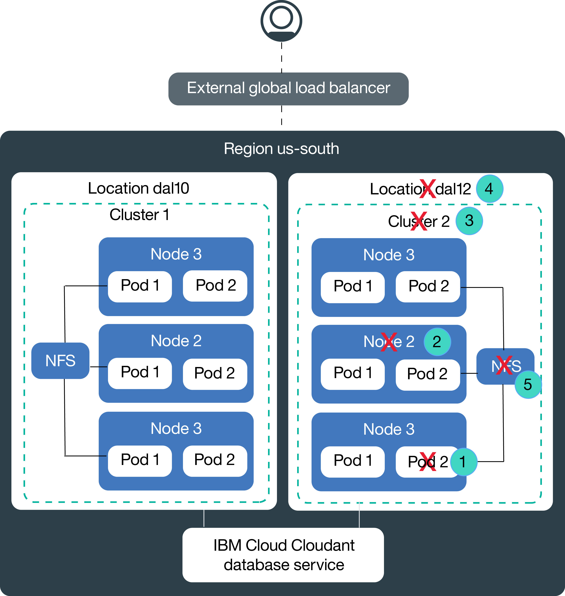

---

copyright:
  years: 2014, 2018
lastupdated: "2018-01-24"

---

{:new_window: target="_blank"}
{:shortdesc: .shortdesc}
{:screen: .screen}
{:pre: .pre}
{:table: .aria-labeledby="caption"}
{:codeblock: .codeblock}
{:tip: .tip}
{:download: .download}

# High availability for {{site.data.keyword.containerlong_notm}}
{: #hadr}

High availability (HA) is a core discipline in an IT infrastructure to keep your apps up and running, even after a partial or full site failure. The main target of HA is to eliminate potential fault domains in an IT infrastructure, for example, by adding redundancy and setting up failover mechanisms. Simply put, high availability is the process in which a system is supposed to take over when another system stops working efficiently or at all.  For IT, this must occur with as minimal downtime as possible—so minimal that most users don’t even know there was a problem.  Data loss must also be negligible; 

HA can be achieved on different levels in your IT infrastructure and within different components of your cluster. The level of HA that is right for you depends on your business requirements and the Service Level Agreements that you have with your customers.  

## Overview of potential fault domains in {{site.data.keyword.containerlong_notm}}
{: #fault_domains}

The following image shows how you can achieve high availability for a stateful app in a single {{site.data.keyword.containerlong_notm}} region. By setting up multiple clusters within a region, you can protect your app from potential fault domains that are marked with an 'X'. Both clusters share data via the IBM Cloud Cloudant database service, so that one cluster can take over the workload without a downtime in case an entire data center is not reachable. 

|#|Fault domain name|Description|Link to docs
|---|---|---|---|
1|Container or pod failure|Containers and pods are, by design, short-lived and can fail unexpectedly. For example, a container or pod might crash if an error occurs in your app. To make your app highly available, you must ensure that you have enough instances of your app to handle the workload plus additional instances to failover. Ideally, these instances are distributed across multiple worker nodes to protect yourself from a worker node failure.|[Highly available apps](cs_app.html#highly_available_apps)|
2|Worker node failure|A worker node is a VM that is running on top of a physical hardware. Failures include hardware outages, like for example power, cooling, or networking, and issues on the VM itself. You can account for a worker node failure by setting up multiple worker nodes in your cluster.   **Note**: Worker nodes in one data center are not guaranteed to be on separate physical compute hosts. For example, you might have a cluster with 3 worker nodes. All 3 worker nodes were created on the same physical compute host. If this physical compute host goes down, all your worker nodes are down. To protect against this failure, you must set up a second cluster in another data center.|[Create clusters with multiple worker nodes](cs_cli_reference.html#cs_cluster_create)|
3|Cluster failure|The Kubernetes master is the main component to keep your cluster up and running. All cluster data is stored in the etcd database that serves as the single point of truth for your cluster. A cluster failure occurs when the master cannot be reached due to a networking failure or when data in your etcd database get corrupted. You can create multiple clusters in one data center to protect your apps from a Kubernetes master or etcd failure. To load balance between the clusters, you must set up an external load balancer.   **Note**: Setting up multiple clusters in one data center does not guarantee that your worker nodes are deployed on separate physical compute hosts. To protect against this failure, you must set up a second cluster in another data center. |[Highly available clusters](cs_clusters.html#planning_clusters)|
4|Location failure|A location failure affects the whole data center and all physical compute hosts. Potential failures might be the outage of power, cooling, networking, orstorage outages, and natural disasters, like flodding, earthquakes, and hurricanes. To protect against a location failure, you must have clusters in two different data centers that are load balanced by an external load balancer.|[Highly available clusters](cs_clusters.html#planning_clusters)|

### How do I make my data highly available?  
The main challenge when you create highly available stateful apps is to come up with a way to keep your data in sync across multiple app instances and multiple locations. You want to make sure that you have one master database that holds all the data of your app and that data in this master is continuously replicated. All instances in your cluster must read from and write to this master database.

In {{site.data.keyword.containerlong_notm}} you can achieve this goal by using one of the following approaches: <ul><li>**Cloud database service:** You can use a Cloud database service, like for example IBM Cloud Cloudant to keep data in sync between clusters that are deployed in different data centers of a region.  If you want to use a different Cloud database service, make sure that the service provider offers global replication across data centers and Cloud regions. Also, check with your service provider to learn about the availability of the service and mechanisms to protect from failures on their side.</li><li>**VPN connection to your on-prem database:**  You can connect your pods to your on-premise datacenter by setting up a VPN connection. With this option, you can use your existing replication method and availability capabilities. </li></ul>

For apps that do not require data replication across data centers or regions, you can persist data on NFS file shares by using Kubernetes persistent volumes. NFS file shares are encrypted at REST and can be replicated to another data center. NFS file shares cannot be used to keep data in sync across data centers or regions. 

legal approval for data storage
how is data replicated in Cloudant
https://www.ibm.com/blogs/bluemix/2017/07/kubernetes-and-bluemix-container-based-workloads-part4/
