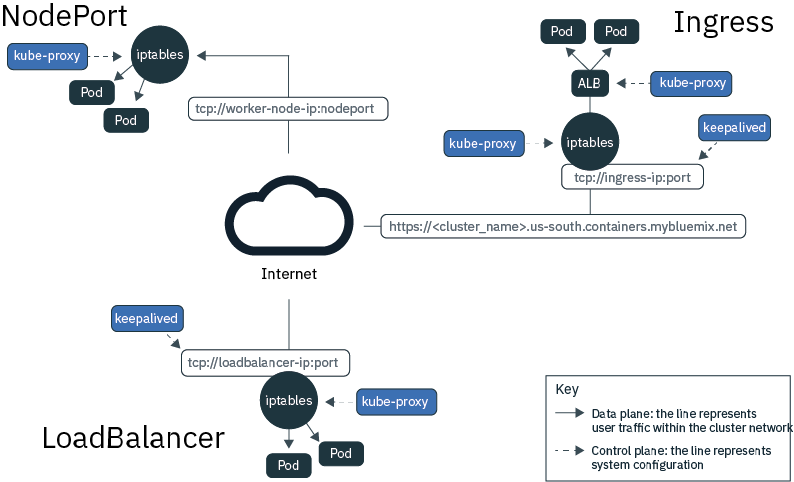

---

copyright:
  years: 2014, 2018
lastupdated: "2018-4-24"

---

{:new_window: target="_blank"}
{:shortdesc: .shortdesc}
{:screen: .screen}
{:pre: .pre}
{:table: .aria-labeledby="caption"}
{:codeblock: .codeblock}
{:tip: .tip}
{:download: .download}

# Planning networking with NodePort, LoadBalancer, or Ingress services
{: #planning}

When you create a Kubernetes cluster in {{site.data.keyword.containerlong}}, every cluster must be connected to a public VLAN. The public VLAN determines the public IP address that is assigned to a worker node during cluster creation.
{:shortdesc}

The public network interface for the worker nodes in both free and standard clusters is protected by Calico network policies. These policies block most inbound traffic by default. However, inbound traffic that is necessary for Kubernetes to function is allowed, as are connections to NodePort, LoadBalancer, and Ingress services. For more information about these policies, including how to modify them, see [Network policies](cs_network_policy.html#network_policies).

|Cluster type|Manager of the public VLAN for the cluster|
|------------|------------------------------------------|
|Free clusters in {{site.data.keyword.Bluemix_notm}}|{{site.data.keyword.IBM_notm}}|
|Standard clusters in {{site.data.keyword.Bluemix_notm}}|You in your IBM Cloud infrastructure (SoftLayer) account|

For more information about in-cluster network communication between worker nodes and pods, ee [In-cluster networking](cs_secure.html#in_cluster_network). For more information about securely connecting apps that run in a Kubernetes cluster to an on-premises network or to apps that are external to your cluster, see [Setting up VPN connectivity](cs_vpn.html).

## Allowing public access to apps
{: #public_access}

To make an app publicly available to the internet, you must update your configuration file before you deploy the app into a cluster.
{:shortdesc}

*Kubernetes data plane in {{site.data.keyword.containershort_notm}}*

The diagram shows how Kubernetes carries user network traffic in {{site.data.keyword.containershort_notm}}. To make your app accessible from the internet, your ways vary depending on whether you created a free or a standard cluster.

<dl>
<dt><a href="cs_nodeport.html#planning" target="_blank">NodePort service</a> (free and standard clusters)</dt>
<dd>
 <ul>
  <li>Expose a public port on every worker node and use the public IP address of any worker node to publicly access your service in the cluster.</li>
  <li>Iptables is a Linux kernel feature that load balances requests across the app's pods, provides high-performance networking routing, and provides network access control.</li>
  <li>The public IP address of the worker node is not permanent. When a worker node is removed or re-created, a new public IP address is assigned to the worker node.</li>
  <li>The NodePort service is great for testing public access. It can also be used if you need public access for only a short amount of time.</li>
 </ul>
</dd>
<dt><a href="cs_loadbalancer.html#planning" target="_blank">LoadBalancer service</a> (standard clusters only)</dt>
<dd>
 <ul>
  <li>Every standard cluster is provisioned with four portable public and four portable private IP addresses that you can use to create an external TCP/UDP load balancer for your app.</li>
  <li>Iptables is a Linux kernel feature that load balances requests across the app's pods, provides high-performance networking routing, and provides network access control.</li>
  <li>The portable public IP address that is assigned to the load balancer is permanent and does not change when a worker node is re-created in the cluster.</li>
  <li>You can customize your load balancer by exposing any port that your app requires.</li></ul>
</dd>
<dt><a href="cs_ingress.html#planning" target="_blank">Ingress</a> (standard clusters only)</dt>
<dd>
 <ul>
  <li>Expose multiple apps in your cluster by creating one external HTTP or HTTPS, TCP, or UDP load balancer. The load balancer uses a secured and unique public entry point to route incoming requests to your apps.</li>
  <li>You can use one public route to expose multiple apps in your cluster as services.</li>
  <li>Ingress consists of two components:
   <ul>
    <li>The Ingress resource defines the rules for how to route and load balance incoming requests for an app.</li>
    <li>The application load balancer (ALB) listens for incoming HTTP or HTTPS, TCP, or UDP service requests. It forwards requests across the apps' pods based on the rules that you defined in the Ingress resource.</li>
   </ul>
  <li>Use Ingress if you want to implement your own ALB with custom routing rules and if you need SSL termination for your apps.</li>
 </ul>
</dd></dl>

To choose the best networking option for your application, you can follow this decision tree. For planning information and configuration instructions, click the networking service option that you choose.

<map name="networking_map" id="networking_map">
<area href="/docs/containers/cs_nodeport.html" alt="Nodeport service" shape="circle" coords="52, 283, 45"/>
<area href="/docs/containers/cs_loadbalancer.html" alt="LoadBalancer service" shape="circle" coords="247, 419, 44"/>
<area href="/docs/containers/cs_ingress.html" alt="Ingress service" shape="circle" coords="445, 420, 45"/>
</map>
