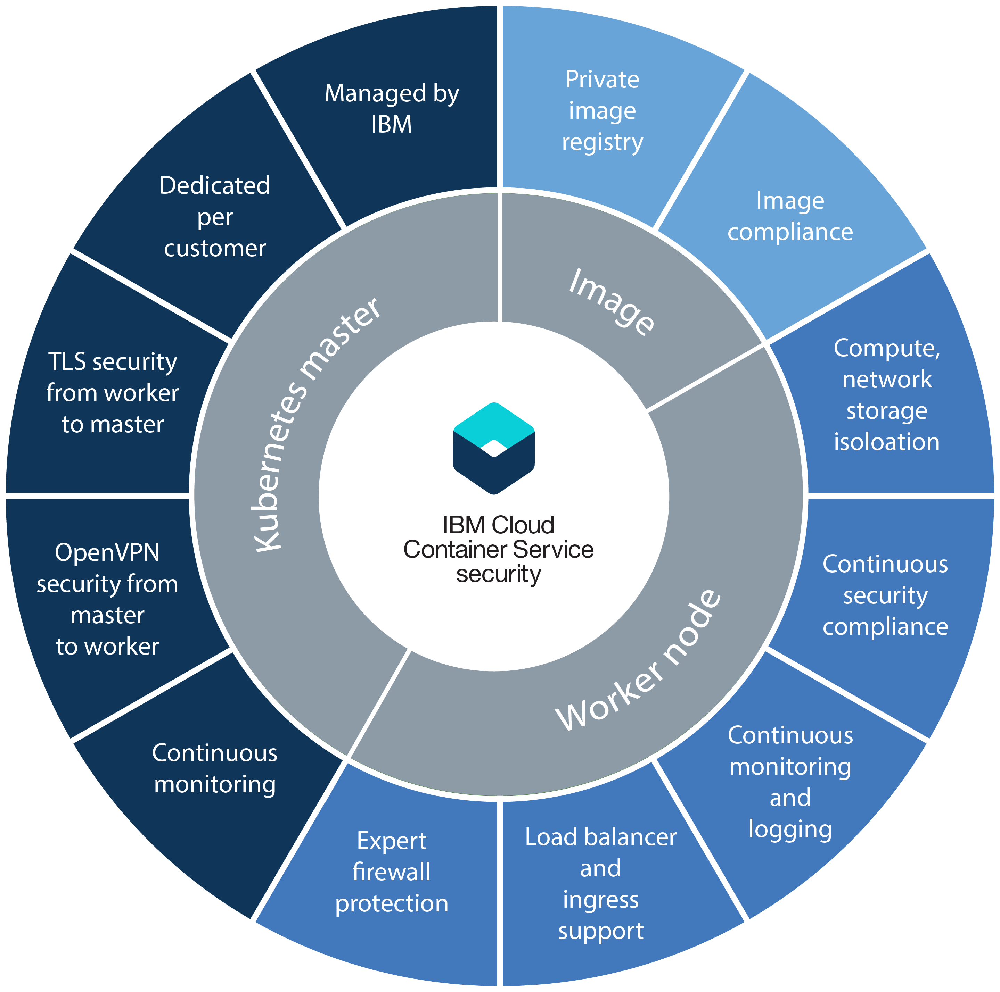

---

copyright:
  years: 2014, 2018
lastupdated: "2018-04-17"

---

{:new_window: target="_blank"}
{:shortdesc: .shortdesc}
{:screen: .screen}
{:pre: .pre}
{:table: .aria-labeledby="caption"}
{:codeblock: .codeblock}
{:tip: .tip}
{:download: .download}

# Security for {{site.data.keyword.containerlong_notm}}
{: #security}

You can use built-in security features in {{site.data.keyword.containerlong}} for risk analysis and security protection. These features help you to protect your Kubernetes cluster infrastructure and network communication, isolate your compute resources, and ensure security compliance across your infrastructure components and container deployments.
{: shortdesc}

## Security by cluster component
{: #cluster}

Each {{site.data.keyword.containerlong_notm}} cluster has security features that are built in to its [master](#master) and [worker](#worker) nodes.
{: shortdesc}

If you have a firewall, need to access load balancing from outside the cluster, or want to run `kubectl` commands from your local system when corporate network policies prevent access to public internet endpoints, [open ports in your firewall](cs_firewall.html#firewall). If you want to connect apps in your cluster to an on-premises network or to other apps external to your cluster, [set up VPN connectivity](cs_vpn.html#vpn).

In the following diagram, you can see security features that are grouped by Kubernetes master, worker nodes, and container images.

  <table summary="The first row in the table spans both columns. The remaining rows are to be read left to right, with the server location in column one and IP addresses to match in column two.">
  <thead>
  <th colspan=2> Built-in cluster security settings in {{site.data.keyword.containershort_notm}}</th>
  </thead>
  <tbody>
    <tr>
      <td>Kubernetes master</td>
      <td>The Kubernetes master in each cluster is managed by IBM and is highly available. It includes {{site.data.keyword.containershort_notm}} security settings that ensure security compliance and secure communication to and from the worker nodes. Security updates are performed by IBM as required. The dedicated Kubernetes master centrally controls and monitors all Kubernetes resources in the cluster. Based on the deployment requirements and capacity in the cluster, the Kubernetes master automatically schedules your containerized apps to deploy across available worker nodes. For more information, see [Kubernetes master security](#master).</td>
    </tr>
    <tr>
      <td>Worker node</td>
      <td>Containers are deployed on worker nodes that are dedicated to a cluster and that ensure compute, network, and storage isolation for IBM customers. {{site.data.keyword.containershort_notm}} provides built-in security features to keep your worker nodes secure on the private and public network and to ensure worker node security compliance. For more information, see [Worker node security](#worker). In addition, you can add [Calico network policies](cs_network_policy.html#network_policies) to further specify the network traffic that you want to allow or block to and from a pod on a worker node.</td>
     </tr>
     <tr>
      <td>Images</td>
      <td>As the cluster admin, you can set up your own secure Docker image repository in {{site.data.keyword.registryshort_notm}} where you can store and share Docker images between your cluster users. To ensure safe container deployments, every image in your private registry is scanned by Vulnerability Advisor. Vulnerability Advisor is a component of {{site.data.keyword.registryshort_notm}} that scans for potential vulnerabilities, makes security recommendations, and provides instructions to resolve vulnerabilities. For more information, see [Image security in {{site.data.keyword.containershort_notm}}](#images).</td>
    </tr>
  </tbody>
</table>

 

## Kubernetes master
{: #master}

Review the built-in Kubernetes master security features to protect the Kubernetes master and to secure the cluster network communication.
{: shortdesc}

<dl>
  <dt>Fully managed and dedicated Kubernetes master</dt>
    <dd>Every Kubernetes cluster in {{site.data.keyword.containershort_notm}} is controlled by a dedicated Kubernetes master that is managed by IBM in an IBM-owned IBM Cloud infrastructure (SoftLayer) account. The Kubernetes master is set up with the following dedicated components that are not shared with other IBM customers.
    <ul><li>etcd data store: Stores all Kubernetes resources of a cluster, such as Services, Deployments, and Pods. Kubernetes ConfigMaps and Secrets are app data that are stored as key value pairs so that they can be used by an app that runs in a pod. Data in etcd is stored on an encrypted disk that is managed by IBM and backed up daily. When sent to a pod, data is encrypted via TLS to assure data protection and integrity. </li>
    <li>kube-apiserver: Serves as the main entry point for all requests from the worker node to the Kubernetes master. The kube-apiserver validates and processes requests and can read from and write to the etcd data store.</li>
    <li>kube-scheduler: Decides where to deploy pods, taking into account capacity and performance needs, hardware and software policy constraints, anti-affinity specifications, and workload requirements. If no worker node can be found that matches the requirements, the pod is not deployed in the cluster.</li>
    <li>kube-controller-manager: Responsible for monitoring replica sets, and creating corresponding pods to achieve the desired state.</li>
    <li>OpenVPN: {{site.data.keyword.containershort_notm}}-specific component to provide secured network connectivity for all Kubernetes master to worker node communication.</li></ul></dd>
  <dt>TLS secured network connectivity for all worker node to Kubernetes master communication</dt>
    <dd>To secure the network communication to the Kubernetes master, {{site.data.keyword.containershort_notm}} generates TLS certificates that encrypt the communication to and from the kube-apiserver and etcd data store components for every cluster. These certificates are never shared across clusters or across Kubernetes master components.</dd>
  <dt>OpenVPN secured network connectivity for all Kubernetes master to worker node communication</dt>
    <dd>Although Kubernetes secures the communication between the Kubernetes master and worker nodes by using the `https` protocol, no authentication is provided on the worker node by default. To secure this communication, {{site.data.keyword.containershort_notm}} automatically sets up an OpenVPN connection between the Kubernetes master and the worker node when the cluster is created.</dd>
  <dt>Continuous Kubernetes master network monitoring</dt>
    <dd>Every Kubernetes master is continuously monitore
      d by IBM to control and remediate process level Denial-Of-Service (DOS) attacks.</dd>
  <dt>Kubernetes master node security compliance</dt>
    <dd>{{site.data.keyword.containershort_notm}} automatically scans every node where the Kubernetes master is deployed for vulnerabilities found in Kubernetes and OS-specific security fixes that need to be applied to assure master node protection. If vulnerabilities are found, {{site.data.keyword.containershort_notm}} automatically applies fixes and resolves vulnerabilities on behalf of the user.</dd>
</dl>

 

## Worker nodes
{: #worker}

Review the built-in worker node security features to protect the worker node environment and to assure resource, network, and storage isolation.
{: shortdesc}

<dl>
  <dt>Worker node ownership</dt>
    <dd>The ownership of worker nodes depends on the type of cluster that you create. 
 Worker nodes in free clusters are provisioned in to the IBM Cloud infrastructure (SoftLayer) account that is owned by IBM. Users can deploy apps to the worker nodes but cannot change settings or install additional software on the worker node.
 
Worker nodes in standard clusters are provisioned in to the IBM Cloud infrastructure (SoftLayer) account that is associated with the customer's public or dedicated IBM Cloud account. The worker nodes are owned by the customer. Customers can choose to change security settings or install additional software on the worker nodes as provided by IBM Cloud Container Service.
 </dd>
  <dt>Compute, network and storage infrastructure isolation</dt>
    <dd>When you create a cluster, worker nodes are provisioned as virtual machines by IBM using the IBM Cloud infrastructure (SoftLayer) portfolio. Worker nodes are dedicated to a cluster and do not host workloads of other clusters.
 Every {{site.data.keyword.Bluemix_notm}} account is set up with IBM Cloud infrastructure (SoftLayer) VLANs to assure quality network performance and isolation on the worker nodes. You can also designate worker nodes as private by connecting them to a private VLAN only.
 
To persist data in your cluster, you can provision dedicated NFS based file storage from IBM Cloud infrastructure (SoftLayer) and leverage the built-in data security features of that platform. 
</dd>
  <dt>Secured worker node set up</dt>
    <dd>Every worker node is set up with an Ubuntu operating system that cannot be changed by the worker node owner. Because the operating system of the worker node is Ubuntu, all containers deployed to the worker node must use a Linux distribution that uses the Ubuntu kernel. Linux distributions that must talk to the kernel in a different way cannot be used. To protect the operating system of the worker nodes from potential attacks, every worker node is configured with expert firewall settings that are enforced by Linux iptable rules.
 All containers that run on Kubernetes are protected by predefined Calico network policy settings that are configured on every worker node during cluster creation. This set up ensures secure network communication between worker nodes and pods. 

 SSH access is disabled on the worker node. If you have a standard cluster and you want to install additional features on your worker node, you can use [Kubernetes daemon sets ](https://kubernetes.io/docs/concepts/workloads/controllers/daemonset) for everything that you want to run on every worker node, or [Kubernetes jobs ](https://kubernetes.io/docs/concepts/workloads/controllers/jobs-run-to-completion/) for any one-time action you must execute.
</dd>
  <dt>Kubernetes worker node security compliance</dt>
    <dd>IBM works with internal and external security advisory teams to address potential security compliance vulnerabilities. <b>Important</b>: Use the `bx cs worker-update` [command](cs_cli_reference.html#cs_worker_update) regularly (such as monthly) to deploy updates and security patches to the operating system and to update the Kubernetes version. When updates are available, you are notified when you view information about the worker nodes, such as with the `bx cs workers <cluster_name>` or `bx cs worker-get <cluster_name> <worker_ID>` commands.</dd>
  <dt>Option to deploy nodes on physical (bare metal) servers</dt>
  <dd>If you choose to provision your worker nodes on bare metal physical servers (instead of virtual server instances), you have additional control over the compute host, such as the memory or CPU. This setup eliminates the virtual machine hypervisor that allocates physical resources to virtual machines that run on the host. Instead, all of a bare metal machine's resources are dedicated exclusively to the worker, so you don't need to worry about "noisy neighbors" sharing resources or slowing down performance. Bare metal servers are dedicated to you, with all its resources available for cluster usage.</dd>
  <dt id="trusted_compute">{{site.data.keyword.containershort_notm}} with Trusted Compute</dt>
  <dd>
When you [deploy your cluster on bare metal](cs_clusters.html#clusters_ui) that supports Trusted Compute, you can enable trust. The Trusted Platform Module (TPM) chip is enabled on each bare metal worker node in the cluster that supports Trusted Compute (including future nodes that you add to the cluster). Therefore, after you enable trust, you cannot later disable it for the cluster. A trust server is deployed on the master node, and a trust agent is deployed as a pod on the worker node. When your worker node starts up, the trust agent pod monitors each stage of the process.

  
For example, if an unauthorized user gains access to your system and modifies the OS kernel with additional logic to collect data, the trust agent detects this and changes the node's trusted status so that you know that the worker is no longer trusted. With trusted compute, you can verify your worker nodes against tampering.

  

